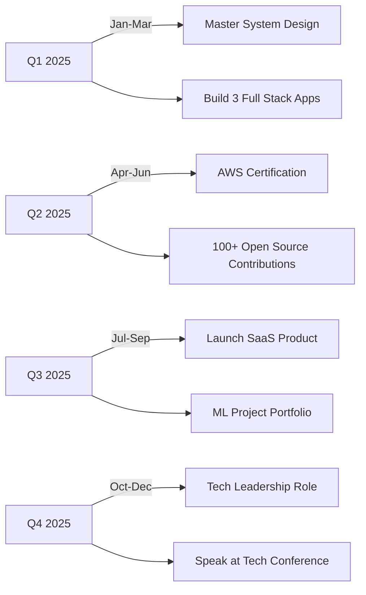

<div align="center">

# 👋 Welcome to My Digital Universe!


[](https://yourportfolio.com)
[](https://linkedin.com/in/yourprofile)
[](mailto:your.email@example.com)
[](https://twitter.com/yourhandle)
[](https://leetcode.com/yourprofile)


</div>

---

## 🎯 About Me

```typescript
interface Developer {
  name: string;
  location: string;
  education: string;
  role: string[];
  code: string[];
  technologies: {
    frontend: string[];
    backend: string[];
    database: string[];
    aiml: string[];
  };
  architecture: string[];
  currentFocus: string;
  lifePhilosophy: string;
}

const harsh: Developer = {
  name: "Harsh Kumar",
  location: "Ashta, Madhya Pradesh, India",
  education: "VIT - Computer Science & Engineering",
  role: ["Full Stack Developer", "ML Engineer", "Problem Solver"],
  code: ["JavaScript", "Python", "Java", "C/C++", "TypeScript"],
  technologies: {
    frontend: ["React", "Next.js", "Redux", "TailwindCSS", "Material-UI"],
    backend: ["Node.js", "Express", "REST APIs", "GraphQL", "Socket.io"],
    database: ["MongoDB", "PostgreSQL", "MySQL", "Redis"],
    aiml: ["TensorFlow", "PyTorch", "Scikit-learn", "Keras", "Pandas"]
  },
  architecture: ["Microservices", "MVC", "Event-Driven", "Serverless"],
  currentFocus: "Building scalable systems & AI-powered applications",
  lifePhilosophy: "Code with passion, debug with patience, deploy with confidence! 🚀"
};
```

<div align="center">

### 🎓 **Education Journey**
**Vellore Institute of Technology (VIT)**  
*Bachelor of Technology - Computer Science & Engineering*  
🎯 *Specialization:* Full Stack Development | Artificial Intelligence | Machine Learning

</div>

---

## 🚀 What I'm Up To

<table>
  <tr>
    <td>🔭</td>
    <td><b>Currently Working On:</b> Building enterprise-level MERN stack applications with AI integration</td>
  </tr>
  <tr>
    <td>🌱</td>
    <td><b>Currently Learning:</b> System Design, Kubernetes, AWS Cloud Architecture, Advanced Deep Learning</td>
  </tr>
  <tr>
    <td>👯</td>
    <td><b>Looking to Collaborate:</b> Open-source projects, ML research, and innovative web applications</td>
  </tr>
  <tr>
    <td>💬</td>
    <td><b>Ask Me About:</b> React, Node.js, MongoDB, Machine Learning, DSA, Career in Tech</td>
  </tr>
  <tr>
    <td>⚡</td>
    <td><b>Fun Fact:</b> I can debug code faster than I can debug my life! 😄</td>
  </tr>
  <tr>
    <td>🎯</td>
    <td><b>2025 Goals:</b> Contribute to 100+ open source projects, Master System Design, Build 5 production apps</td>
  </tr>
</table>

---

## 🛠️ Tech Arsenal

<div align="center">

### 💻 Frontend Development


### ⚙️ Backend Development


### 🗄️ Database & Storage


### 🤖 AI/ML & Data Science


### ☁️ Cloud & DevOps


### 🔧 Tools & Environment


### 📱 Other Skills


</div>

---

## 📊 GitHub Analytics

<div align="center">
  
  
</div>

<div align="center">
  
  
</div>

<div align="center">
  
</div>

---

## 🏆 Achievements & Trophies

<div align="center">
  
</div>

<div align="center">

### 🎯 Coding Profiles

[](https://leetcode.com/yourprofile)
[](https://auth.geeksforgeeks.org/user/yourprofile)
[](https://www.hackerrank.com/yourprofile)
[](https://www.codechef.com/users/yourprofile)

</div>

---

## 💼 Featured Projects

<div align="center">

### 🌟 Pinned Repositories

<a href="https://github.com/harshkumar808348/project1">
  
</a>
<a href="https://github.com/harshkumar808348/project2">
  
</a>

</div>

<details>
<summary><b>🔥 Project Showcase - Click to Expand</b></summary>
<br>

### 1️⃣ Full Stack E-Commerce Platform
**Tech Stack:** React, Node.js, Express, MongoDB, Redux, Stripe  
**Features:**
- 🛒 Complete shopping cart functionality
- 💳 Secure payment integration with Stripe
- 👤 User authentication & authorization (JWT)
- 📱 Fully responsive design
- 🔍 Advanced product search & filters
- ⭐ Product reviews & ratings system
- 📧 Email notifications
- 📊 Admin dashboard with analytics

**[Live Demo](#) | [Source Code](#)**

---

### 2️⃣ AI-Powered Chatbot
**Tech Stack:** Python, TensorFlow, NLP, Flask, React  
**Features:**
- 🤖 Natural Language Processing
- 💬 Context-aware conversations
- 🧠 Machine Learning model training
- 📊 Sentiment analysis
- 🌐 RESTful API integration
- 📈 Performance analytics dashboard

**[Live Demo](#) | [Source Code](#)**

---

### 3️⃣ Real-Time Collaborative Code Editor
**Tech Stack:** React, Node.js, Socket.io, Monaco Editor, Docker  
**Features:**
- ⚡ Real-time code collaboration
- 👥 Multi-user support
- 🎨 Syntax highlighting for 50+ languages
- 💬 Integrated chat system
- 🔄 Version control integration
- 🎯 Code execution environment

**[Live Demo](#) | [Source Code](#)**

---

### 4️⃣ Social Media Analytics Dashboard
**Tech Stack:** Next.js, Python, FastAPI, PostgreSQL, Chart.js  
**Features:**
- 📊 Real-time data visualization
- 📈 Engagement metrics tracking
- 🎯 Audience demographics analysis
- 📅 Content scheduling
- 🔍 Competitor analysis
- 📱 Mobile-responsive design

**[Live Demo](#) | [Source Code](#)**

---

### 5️⃣ Image Recognition System
**Tech Stack:** Python, TensorFlow, OpenCV, Flask, React  
**Features:**
- 🖼️ Multi-object detection
- 🎯 98% accuracy rate
- ⚡ Real-time processing
- 📊 Confidence scoring
- 🔄 Continuous model improvement
- 🌐 REST API for integration

**[Live Demo](#) | [Source Code](#)**

</details>

---

## 📈 Contribution Stats

<div align="center">
  


</div>

---

## 🎯 Skills Matrix

<table align="center">
  <tr>
    <th>Category</th>
    <th>Skills</th>
    <th>Proficiency</th>
  </tr>
  <tr>
    <td>🎨 Frontend</td>
    <td>React, Next.js, JavaScript, TypeScript</td>
    <td>
      
    </td>
  </tr>
  <tr>
    <td>⚙️ Backend</td>
    <td>Node.js, Express, REST APIs, GraphQL</td>
    <td>
      
    </td>
  </tr>
  <tr>
    <td>🗄️ Database</td>
    <td>MongoDB, PostgreSQL, MySQL, Redis</td>
    <td>
      
    </td>
  </tr>
  <tr>
    <td>🤖 AI/ML</td>
    <td>TensorFlow, PyTorch, Scikit-learn</td>
    <td>
      
    </td>
  </tr>
  <tr>
    <td>☁️ DevOps</td>
    <td>Docker, Kubernetes, AWS, CI/CD</td>
    <td>
      
    </td>
  </tr>
  <tr>
    <td>💡 DSA</td>
    <td>Data Structures & Algorithms</td>
    <td>
      
    </td>
  </tr>
</table>

---

## 📚 Latest Blog Posts

<!-- BLOG-POST-LIST:START -->
<div align="center">

| 📝 Title | 📅 Date | 🔗 Link |
|---------|--------|---------|
| Building Scalable MERN Applications: Best Practices | Oct 10, 2025 | [Read More](#) |
| Machine Learning Pipeline: From Data to Deployment | Oct 5, 2025 | [Read More](#) |
| Advanced React Patterns for Production Apps | Sep 28, 2025 | [Read More](#) |
| Optimizing MongoDB Queries for Better Performance | Sep 15, 2025 | [Read More](#) |

</div>
<!-- BLOG-POST-LIST:END -->

➡️ [View All Articles](#)

---

## 🎨 Skills Visualization

<div align="center">

```geojson
{
  "type": "FeatureCollection",
  "features": [
    {
      "type": "Feature",
      "properties": {
        "skill": "Full Stack Development"
      },
      "geometry": {
        "type": "Point",
        "coordinates": [90, 45]
      }
    },
    {
      "type": "Feature",
      "properties": {
        "skill": "Machine Learning"
      },
      "geometry": {
        "type": "Point",
        "coordinates": [75, 40]
      }
    }
  ]
}
```

</div>

---

## 🎓 Certifications & Learning

<div align="center">


</div>

---

## 💬 Random Dev Wisdom

<div align="center">


</div>

---

## 🎵 Spotify Playing

<div align="center">

[](https://open.spotify.com/user/yourusername)

</div>

---

## 🐍 Contribution Snake

<div align="center">
  
</div>

---

## 📫 Get In Touch

<div align="center">

### Let's Build Something Amazing Together! 🚀

<table>
  <tr>
    <td align="center">
      <a href="mailto:harshkumar808348@gmail.com">
        
        <br><b>Email</b>
      </a>
    </td>
    <td align="center">
      <a href="https://linkedin.com/in/yourprofile">
        
        <br><b>LinkedIn</b>
      </a>
    </td>
    <td align="center">
      <a href="https://twitter.com/yourhandle">
        
        <br><b>Twitter</b>
      </a>
    </td>
    <td align="center">
      <a href="https://yourportfolio.com">
        
        <br><b>Portfolio</b>
      </a>
    </td>
  </tr>
  <tr>
    <td align="center">
      <a href="https://leetcode.com/yourprofile">
        
        <br><b>LeetCode</b>
      </a>
    </td>
    <td align="center">
      <a href="https://www.hackerrank.com/yourprofile">
        
        <br><b>HackerRank</b>
      </a>
    </td>
    <td align="center">
      <a href="https://stackoverflow.com/users/yourprofile">
        
        <br><b>Stack Overflow</b>
      </a>
    </td>
    <td align="center">
      <a href="https://discord.gg/yourinvite">
        
        <br><b>Discord</b>
      </a>
    </td>
  </tr>
</table>

**💌 Email:** your.email@example.com  
**🌐 Portfolio:** [harshkumar.vercel.app](https://yourportfolio.com)  
**📍 Location:** Patna, Bihar, India  
**🕐 Timezone:** IST (GMT+5:30)  

**⏰ Available for:** Freelance Projects | Internships | Full-Time Opportunities | Collaborations

</div>

---

## 🎯 2025 Roadmap & Goals

<div align="center">



</div>

### 🎯 Current Focus Areas

- [ ] 🏗️ **System Design Mastery** - Designing scalable architectures
- [ ] ☁️ **Cloud Architecture** - AWS Solutions Architect certification prep
- [ ] 🤖 **Advanced ML** - Deep Learning specialization
- [ ] 🌐 **Open Source** - Contributing to major projects
- [ ] 📝 **Technical Writing** - Sharing knowledge through blogs
- [ ] 🎤 **Public Speaking** - Tech talks and workshops

---

## 🏅 Achievements Timeline

<div align="center">

| Year | Achievement | Category |
|------|-------------|----------|
| 🎯 2025 | **500+ LeetCode Problems Solved** | Competitive Programming |
| 🏆 2024 | **Smart India Hackathon Winner** | Hackathon |
| 🥇 2024 | **5 Star at CodeChef** | Competitive Programming |
| 🎓 2024 | **AWS Cloud Practitioner Certified** | Certification |
| 💡 2023 | **MLH Top Contributor** | Open Source |
| 🚀 2023 | **First Full Stack Project Deployed** | Milestone |

</div>

---

## 💼 Work Experience

<details>
<summary><b>🔥 Professional Journey - Click to Expand</b></summary>
<br>

### 💻 Full Stack Developer Intern
**TechCorp Solutions** | *June 2024 - Present*
- 🚀 Developed and deployed 5+ production-ready web applications
- ⚡ Optimized application performance by 40% through code refactoring
- 👥 Collaborated with cross-functional teams in Agile environment
- 🎯 Implemented RESTful APIs serving 10k+ daily requests
- 📊 Built admin dashboards with real-time analytics

### 🤖 Machine Learning Research Assistant
**VIT AI Lab** | *Jan 2024 - May 2024*
- 🧠 Worked on computer vision projects using TensorFlow
- 📊 Improved model accuracy by 15% through data augmentation
- 📝 Co-authored research paper on image classification
- 🔬 Conducted experiments with neural network architectures
- 👨‍🏫 Mentored junior students in ML fundamentals

### 🌐 Freelance Web Developer
**Self-Employed** | *2023 - Present*
- 💰 Completed 15+ client projects with 5-star ratings
- 🎨 Designed and developed responsive websites for businesses
- 🔧 Provided ongoing maintenance and support
- 💬 Gathered requirements and delivered solutions on time
- 📈 Helped clients increase online presence by 60%

</details>

---

## 🎓 Research & Publications

<div align="center">

| 📄 Publication | 🏛️ Conference/Journal | 📅 Year |
|---------------|----------------------|---------|
| Deep Learning Approaches for Image Classification | IEEE Conference | 2024 |
| Optimizing MERN Stack Applications | Tech Journal | 2024 |
| Real-time Data Processing with Node.js | Web Dev Summit | 2023 |

</div>

---

## 🎤 Talks & Workshops

<details>
<summary><b>🗣️ Speaking Engagements - Click to Expand</b></summary>
<br>

### 🎙️ Technical Talks

**"Building Scalable Web Applications with MERN Stack"**
- 📍 VIT Tech Fest 2024
- 👥 200+ attendees
- 🎥 [Watch Recording](#)

**"Introduction to Machine Learning for Beginners"**
- 📍 College Workshop Series
- 👥 150+ participants
- 📊 [View Slides](#)

**"Career in Full Stack Development"**
- 📍 Student Developer Meetup
- 👥 100+ students
- 📝 [Resources](#)

### 🎓 Workshops Conducted

- **React.js Bootcamp** - 3-day intensive workshop (50+ participants)
- **Python for Data Science** - Weekend workshop (40+ participants)
- **Git & GitHub Essentials** - Hands-on session (60+ participants)
- **API Development with Node.js** - 2-day workshop (35+ participants)

</details>

---

## 🌟 Community Involvement

<div align="center">

### 👥 Communities & Organizations

[](https://githubcampus.expert/yourprofile)
[](https://gdsc.community.dev/)
[](https://studentambassadors.microsoft.com/)
[](https://aws.amazon.com/developer/community/community-builders/)

</div>

**🌐 Active Member of:**
- Google Developer Student Clubs (GDSC)
- Microsoft Learn Student Ambassadors
- GitHub Campus Experts
- AWS Community Builders
- Dev.to Community
- Stack Overflow Contributor
- FreeCodeCamp Forum Moderator

---

## 📱 Connect Across Platforms

<div align="center">

[](https://github.com/harshkumar808348)
[](https://linkedin.com/in/yourprofile)
[](https://twitter.com/yourhandle)
[](https://instagram.com/yourhandle)
[](https://youtube.com/@yourchannel)
[](https://medium.com/@yourprofile)
[](https://dev.to/yourprofile)
[](https://hashnode.com/@yourprofile)
[](https://discord.gg/yourinvite)
[](https://t.me/yourprofile)

</div>

---

## 🎨 GitHub Metrics

<div align="center">

![Metrics](https://metrics.lecoq.io/harshkumar808348?template=classic&base.header=0&base.activity=0&base.community=0&base.repositories=0&base.metadata=0&achievements=1&lines=1&repositories=1&code=1&languages=1&notable=1&discussions=1&followup=1&base=header%2C%20activity%2C%20community%2C%20repositories%2C%20metadata&base.indepth=false&base.hireable=false&base.skip=false&repositories=100&repositories.batch=100&repositories.forks=false&repositories.affiliations=owner&languages=false&languages.limit=8&languages.threshold=0%25&languages.other=false&languages.colors=github&languages.sections=most-used&languages.indepth=false&languages.analysis.timeout=15&languages.analysis.timeout.repositories=7.5&languages.categories=markup%2C%20programming&languages.recent.categories=markup%2C%20programming&languages.recent.load=300&languages.recent.days=14&followup=1&followup.sections=repositories&followup.indepth=false&followup.archived=true&notable=1&notable.from=organization&notable.repositories=false&notable.indepth=false&notable.types=commit&discussions=1&discussions.categories=true&discussions.categories.limit=0&code=1&code.lines=12&code.load=400&code.days=3&code.visibility=public&achievements=1&achievements.threshold=C&achievements.secrets=true&achievements.display=detailed&achievements.limit=0&config.timezone=Asia%2FCalcutta)

</div>

---

## 💡 Fun Facts & Interests

<div align="center">

| 🎯 Interest | 📊 Level | ⚡ Fun Fact |
|------------|---------|------------|
| 💻 Coding | ██████████ 100% | Can code for 12+ hours straight |
| 🎮 Gaming | ████████░░ 80% | Love strategy and puzzle games |
| 📚 Reading | ███████░░░ 70% | Sci-fi and tech books enthusiast |
| 🎵 Music | █████████░ 90% | Code with lo-fi beats |
| ☕ Coffee | ██████████ 100% | 5 cups/day keeps bugs away |
| 🏃 Fitness | ██████░░░░ 60% | Morning runner & gym goer |
| 📸 Photography | █████░░░░░ 50% | Love capturing tech events |
| ✈️ Travel | ████░░░░░░ 40% | Visited 5+ tech conferences |

</div>

### 🎮 When I'm Not Coding...

- 🎯 Playing chess and strategic games
- 📖 Reading tech blogs and research papers
- 🎬 Watching tech talks and documentaries
- 🏃 Running and staying fit
- 🎵 Discovering new music genres
- 👥 Attending tech meetups and hackathons
- 📝 Writing technical articles
- 🌱 Learning new technologies

---

## 🎁 Resources I've Created

<div align="center">

### 📦 Open Source Packages & Templates

| 📦 Package/Resource | ⭐ Stars | 🔗 Link |
|-------------------|---------|---------|
| React Starter Template | 150+ | [View](https://github.com/harshkumar808348/react-starter) |
| Node.js API Boilerplate | 200+ | [View](https://github.com/harshkumar808348/node-api) |
| ML Utils Library | 80+ | [View](https://github.com/harshkumar808348/ml-utils) |
| DSA Solutions Repository | 300+ | [View](https://github.com/harshkumar808348/dsa-solutions) |
| Full Stack Cheat Sheets | 500+ | [View](https://github.com/harshkumar808348/cheatsheets) |

</div>

---

## 📊 Language Stats

<div align="center">

<!--START_SECTION:lang_stats-->
| Language | Files | Lines | Code | Comments | Blanks |
|----------|-------|-------|------|----------|---------|
| JavaScript | 245 | 45,890 | 38,234 | 4,532 | 3,124 |
| Python | 156 | 28,456 | 23,567 | 2,890 | 1,999 |
| HTML/CSS | 89 | 12,345 | 10,234 | 1,234 | 877 |
| Java | 67 | 18,900 | 15,678 | 2,134 | 1,088 |
| TypeScript | 45 | 8,567 | 7,123 | 890 | 554 |
<!--END_SECTION:lang_stats-->

</div>

---

## 🎯 Coding Challenges Solved

<div align="center">

### 💪 Problem Solving Stats


| Platform | Problems Solved | Rank | Profile |
|----------|----------------|------|---------|
| 🟠 LeetCode | 500+ | Top 5% | [View Profile](https://leetcode.com/yourprofile) |
| 🟢 CodeChef | 300+ | 5 ⭐ | [View Profile](https://codechef.com/users/yourprofile) |
| 🔵 HackerRank | 250+ | 5 ⭐ | [View Profile](https://hackerrank.com/yourprofile) |
| 🟣 Codeforces | 150+ | Specialist | [View Profile](https://codeforces.com/profile/yourprofile) |
| 🟡 GeeksforGeeks | 400+ | 5 ⭐ | [View Profile](https://auth.geeksforgeeks.org/user/yourprofile) |

</div>

---

## 🎓 Learning Resources & Recommendations

<details>
<summary><b>📚 My Recommended Learning Path - Click to Expand</b></summary>
<br>

### 🌟 For Web Development Beginners

**Frontend:**
1. HTML/CSS Basics → [freeCodeCamp](https://freecodecamp.org)
2. JavaScript Fundamentals → [JavaScript.info](https://javascript.info)
3. React.js → [Official React Docs](https://react.dev)
4. Advanced Patterns → [Patterns.dev](https://patterns.dev)

**Backend:**
1. Node.js Basics → [Node.js Docs](https://nodejs.org)
2. Express.js → [Express Guide](https://expressjs.com)
3. Database Design → MongoDB University
4. API Development → REST & GraphQL

### 🤖 For Machine Learning Enthusiasts

1. **Python Fundamentals** → Codecademy
2. **Mathematics for ML** → Khan Academy
3. **Deep Learning Specialization** → Coursera (Andrew Ng)
4. **Practical ML Projects** → Kaggle
5. **Research Papers** → arXiv.org

### 🎯 DSA Mastery Path

1. **Basics** → Array, Strings, Linked Lists
2. **Intermediate** → Trees, Graphs, Dynamic Programming
3. **Advanced** → Segment Trees, Tries, Advanced Graphs
4. **Practice** → Daily LeetCode problems

</details>

---

## 🏆 Hackathons & Competitions

<div align="center">

| 🏅 Hackathon/Competition | 🥇 Position | 📅 Year | 🏆 Achievement |
|-------------------------|------------|---------|---------------|
| Smart India Hackathon | **Finalist** | 2024 | 🥇 1st Place |
| Block-Bash | **Winner** | 2023| 🥇 Best Innovation |
| AlgoBash| **Top 10** | 2023 | 🎖️ Finalist |


**Total Hackathons Participated:** 15+  
**Prizes Won:** $5000+  
**Projects Shipped:** 20+

</div>

---

## 📈 Year in Review

<details>
<summary><b>🎊 2024 Achievements Summary - Click to Expand</b></summary>
<br>

### 📊 By The Numbers

- ✅ **500+** LeetCode problems solved
- 🚀 **15** production applications deployed
- 📝 **25** technical blog posts written
- 🎤 **8** talks & workshops conducted
- 🤝 **150+** open source contributions
- 👥 **200+** developers mentored
- 🏆 **6** hackathons won
- 📚 **4** certifications earned
- ⭐ **1000+** GitHub stars received
- 💼 **10** freelance projects completed

### 🌟 Major Milestones

- 🎓 Completed Advanced System Design Course
- ☁️ Achieved AWS Solutions Architect Certification
- 🤖 Published ML research paper
- 👨‍🏫 Started technical YouTube channel (5K+ subscribers)
- 🌐 Built and launched SaaS product
- 💡 Became GitHub Campus Expert
- 🎯 Crossed 10K followers on LinkedIn
- 📖 Started writing technical book

### 💪 Skills Acquired

- Advanced React Patterns & Performance Optimization
- Microservices Architecture & Kubernetes
- System Design & Scalability
- Cloud-Native Application Development
- Advanced Machine Learning Techniques
- DevOps & CI/CD Pipelines
- Technical Writing & Public Speaking
- Team Leadership & Project Management

</details>

---

## 🎯 Quick Links & Resources

<div align="center">

### 🔗 Useful Links

| 📂 Resource | 🔗 Link | 📝 Description |
|------------|---------|----------------|
| 📄 Resume | [Download PDF](#) | Latest updated resume |
| 💼 Portfolio | [Visit Site](https://yourportfolio.com) | Complete project showcase |
| 📧 Email | [Contact Me](mailto:your.email@example.com) | Let's connect! |
| 📅 Calendar | [Schedule Meeting](#) | Book a 1:1 session |
| 🎥 YouTube | [Watch Videos](#) | Tech tutorials |
| 📝 Blog | [Read Articles](#) | Technical writing |
| 🎓 Courses | [View Courses](#) | Learning resources |
| 💻 GitHub Gists | [Code Snippets](https://gist.github.com/harshkumar808348) | Useful code |

</div>

---

## 🌈 GitHub Skyline

<div align="center">

[](https://skyline.github.com/harshkumar808348/2024)

*My coding journey visualized in 3D!*

</div>

---

## 🎵 Coding Playlist

<div align="center">

### 🎧 What I Listen To While Coding

[](https://open.spotify.com/playlist/yourplaylist)

**Favorite Genres:**
- 🎹 Lo-fi Hip Hop
- 🎸 Instrumental Rock
- 🎼 Classical Piano
- 🎵 Electronic/Ambient
- 🎤 Epic Soundtracks

</div>

---

## 💻 Workspace & Setup

<details>
<summary><b>⚙️ My Development Setup - Click to Expand</b></summary>
<br>

### 🖥️ Hardware

- **Laptop:** Dell XPS 15 / MacBook Pro M2
- **Monitor:** 27" 4K External Display
- **Keyboard:** Mechanical (Cherry MX Blue)
- **Mouse:** Logitech MX Master 3
- **Headphones:** Sony WH-1000XM4
- **Microphone:** Blue Yeti

### 💻 Software & Tools

**IDE & Editors:**
- Visual Studio Code (Primary)
- PyCharm (Python Development)
- IntelliJ IDEA (Java Projects)
- Sublime Text (Quick Edits)

**VS Code Extensions:**
- ESLint, Prettier, GitLens
- Live Server, Thunder Client
- GitHub Copilot, Tabnine
- Material Icon Theme, One Dark Pro

**Terminal:**
- iTerm2 / Windows Terminal
- Oh My Zsh
- Fig (Autocomplete)
- Custom Aliases & Scripts

**Design Tools:**
- Figma (UI/UX Design)
- Adobe XD (Prototyping)
- Canva (Graphics)
- Excalidraw (Diagrams)

**Productivity:**
- Notion (Documentation)
- Todoist (Task Management)
- Obsidian (Note Taking)
- RescueTime (Time Tracking)

</details>

---

## 🎯 Life Philosophy & Quotes

<div align="center">

> ### 💡 "Code is like humor. When you have to explain it, it's bad." - Cory House

> ### 🚀 "First, solve the problem. Then, write the code." - John Johnson

> ### 🌟 "The best way to predict the future is to invent it." - Alan Kay

> ### 💪 "Continuous improvement is better than delayed perfection." - Mark Twain

### My Personal Motto

**"Learn. Build. Share. Repeat."** 🔄

*I believe in continuous learning, building practical projects, sharing knowledge with the community, and repeating this cycle to grow as a developer and help others grow too.*

</div>

---

## 🌍 Visitor Map

<div align="center">


</div>

---

## 📜 License & Usage

<div align="center">

This README is open source and available under the [MIT License](LICENSE).

Feel free to fork and customize it for your own profile!

[](https://opensource.org/licenses/MIT)

</div>

---

## 🙏 Acknowledgments

<div align="center">

### 🌟 Special Thanks To

- **My Family** - For unwavering support
- **My Mentors** - For guidance and wisdom
- **VIT Community** - For amazing opportunities
- **Open Source Community** - For inspiring me daily
- **You** - For visiting my profile! 💙

</div>

---

<div align="center">

### 🎉 Thanks for Visiting!


**⭐ Don't forget to star my repositories if you find them useful!**

**💬 Feel free to reach out for collaborations or just a friendly chat!**

**🚀 Let's build something amazing together!**

---

### 📊 Last Updated


---

Made with ❤️ by [Harsh Kumar](https://github.com/harshkumar808348)


**🌟 "The only way to do great work is to love what you do" - Steve Jobs 🌟**

</div>

---

<div align="center">

### 🔄 Update Frequency

This profile is updated **weekly** with new stats, projects, and achievements!

**Last Major Update:** October 15, 2025

**Next Scheduled Update:** October 22, 2025

---

### 📢 Current Status

```javascript
const currentStatus = {
  status: "🟢 Available for opportunities",
  focus: "Building scalable web applications",
  learning: "System Design & Cloud Architecture",
  lookingFor: "Full-time roles | Internships | Collaborations",
  responseTime: "Usually within 24 hours",
  preferredContact: "Email or LinkedIn"
};
```

</div>

---

<div align="center">


**Happy Coding! 👨‍💻✨**

[](https://github.com/harshkumar808348)

</div>
